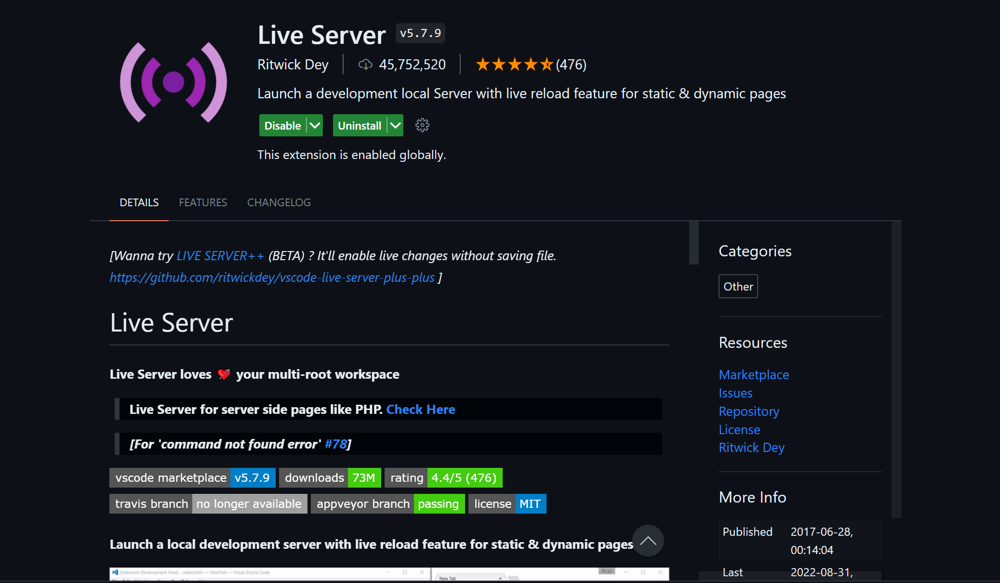
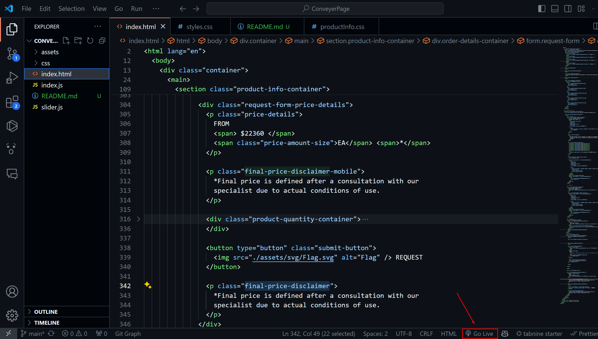

To launch the project you need:

1. install the plugin in vs-code live server

2. After installing reload vs-code

3. when the plugin is installed, there is a Go live button on the bottom right, press it and the project starts (open the browser early)

